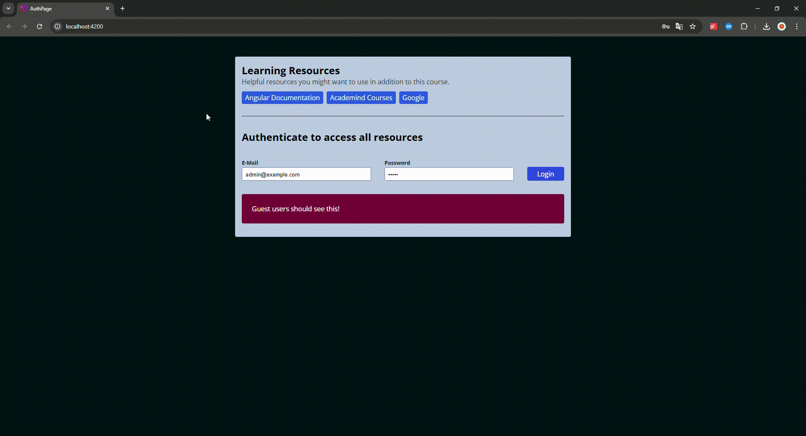

# Documentation for **DirectivesAuthPage**

#### Overview

**DirectivesAuthPage** is an Angular-based web application designed to demonstrate authentication workflows and showcase the use of custom directives. The application is modular, with a focus on clean separation of concerns for improved maintainability and scalability.

---

## Demo



---

## Project Structure

The project follows Angular’s standard structure, with feature modules and directives placed strategically for clarity and reuse.

- **src/app/**: Main application directory containing all feature modules and shared directives.
  - **auth/**: Manages authentication-related functionality.
    - `auth.component.ts`: Main component handling user authentication.
    - `auth.directive.ts`: Custom directive to enhance authentication features.
    - `auth.model.ts`: Defines models related to authentication (e.g., user data structures).
    - `auth.service.ts`: Service to handle authentication logic and API interactions.
  - **learning-resources/**: Displays or manages resources related to learning.
    - `learning-resources.component.ts`: Main component for showcasing or managing learning resources.
  - **Directives**:
    - `log.directive.ts`: A custom directive for logging or tracking events.
    - `safe-link.directive.ts`: Ensures external links are safe to follow, potentially adding additional security layers.
- **src/styles.css**: Global application styles.
- **src/app.component.\***: Root component handling overall application structure and layout.

---

## Key Features

1. **Authentication System**:

   - Modularized authentication workflows with a dedicated component, service, and model.
   - Custom directives to enhance authentication-related UI and logic.

2. **Learning Resources Module**:

   - A feature to showcase educational materials or links.

3. **Custom Directives**:
   - `log.directive.ts`: Adds logging functionality to specific elements or events.
   - `safe-link.directive.ts`: Sanitizes links for enhanced security.

---

## How to Run the Project

1. **Clone the Repository**:

   ```bash
   git clone https://github.com/FilonenkoDima/DirectivesAuthPage.git
   cd DirectivesAuthPage
   ```

2. **Install Dependencies**:
   Ensure you have Node.js and Angular CLI installed, then run:

   ```bash
   npm install
   ```

3. **Run the Application**:

   ```bash
   ng serve
   ```

   The app will be accessible at `http://localhost:4200/`.

4. **Build for Production**:
   ```bash
   ng build --prod
   ```

---

## Technologies Used

- **Frontend**: Angular
- **Styling**: CSS
- **Build Tools**: Angular CLI
- **Version Control**: GitHub

---

## Contribution Guidelines

1. Fork the repository.
2. Create a new feature branch:
   ```bash
   git checkout -b feature/your-feature-name
   ```
3. Commit your changes and push the branch:
   ```bash
   git push origin feature/your-feature-name
   ```
4. Submit a pull request for review.
